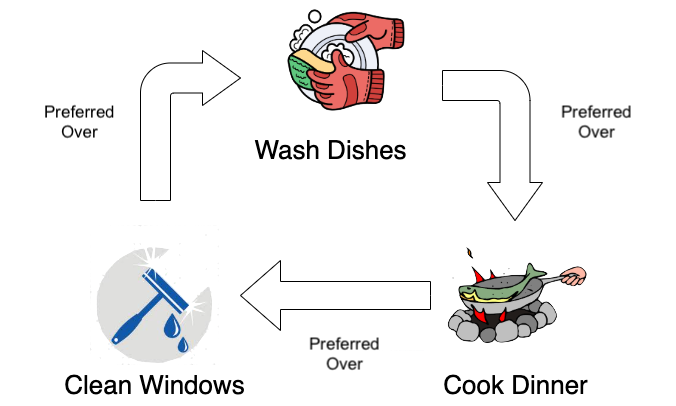
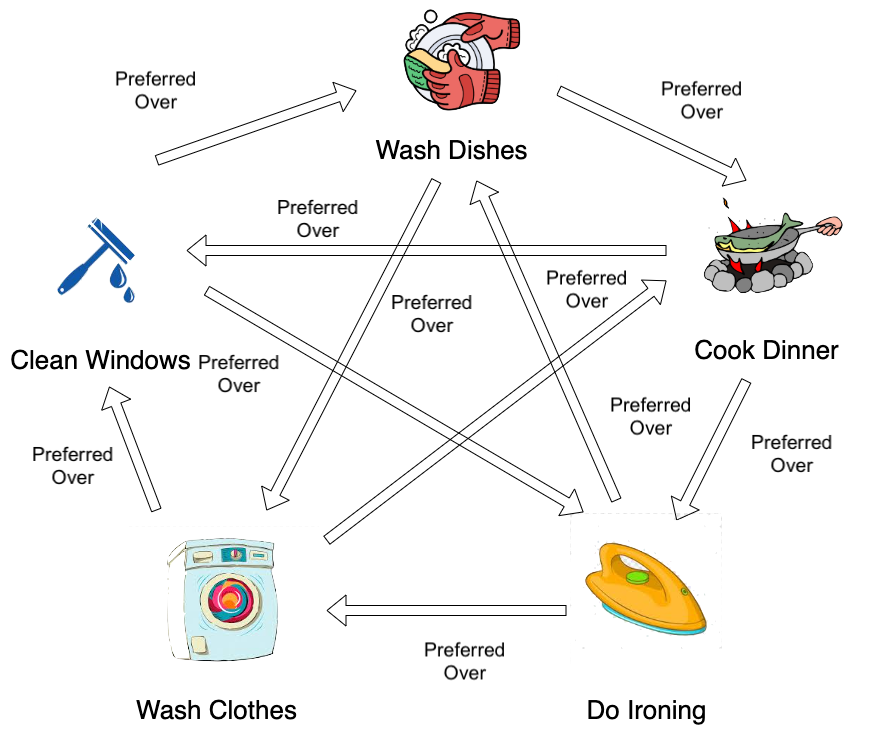

# Lab - Task Decider

## Task

You are going to create a small app where given the option of two tasks from a list of 3, one is chosen over the other.  The 3 tasks are:

- "Wash the Dishes"
- "Cook Dinner"
- "Clean Windows"

The way in which one task is preferred over another is:

- "Wash Dishes" is preferred over "Cook Dinner"
- "Cook Dinner" is preferred over "Clean Windows"
- "Clean Windows is preferred over "Wash Dishes"

You should write tasks for all classes and functions you create. Make sure that you create a separate file for each class and a separate test file for each class/module.

### MVP

Create a class `Task`. `Task`s have a `description`, and a `duration`.

Create a module `task_decider`. This should contain a function `get_preferred_option` which takes in two `Task` objects and returns the preferred task based on the `description` of the `Task`:

Use TDD, creating as many tests as you think you will need.

### Extension

Let's bring in another two tasks, "Wash Clothes" and "Do Ironing", so we are now dealing with five different tasks. You will still be choosing between two tasks so in addition to what has been done already:

- "Wash Dishes" is preferred over "Wash Clothes"
- "Cook Dinner" is preferred over "Do Ironing"
- "Clean Windows" is preferred over "Do Ironing"
- "Do Ironing" is preferred over "Wash Clothes"
- "Do Ironing" is preferred over "Wash Dishes"
- "Wash Clothes" is preferred over "Cook Dinner"
- "Wash Clothes" is preferred over "Clean Windows"

### Files and Directories

  - In your working directory, create two directories, one for your classes and one for your tests
  - Remember to create an empty `__init__.py` file in the directories created above
  - create a `run_tests.py` file in your working directory. Use this file to run your tests.
  - If a method is comparing two things i.e. two `Task`s then create _at least_ two tests for the function, one where the first task is `TASK_X` and the second is `TASK_Y`, and one where the order is reversed i.e. the first task is `TASK_Y` and the second is `TASK_X`

**REMEMBER** to commit to git regularly

